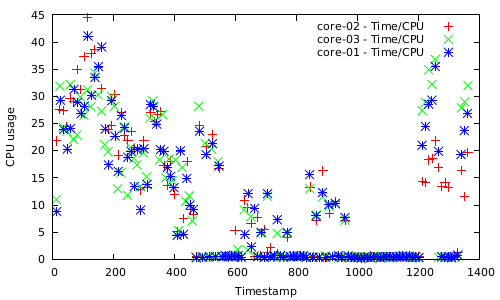
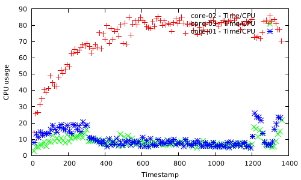
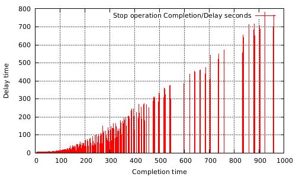
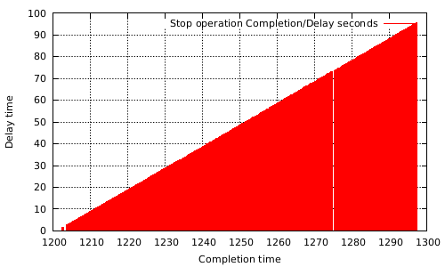

# Nomi Documentation

Nomi is a benchmarking tool that tests a [fleet](https://github.com/coreos/fleet) cluster. With Nomi, you can deploy benchmark units that deploy [Docker](https://github.com/docker/docker), [rkt](https://github.com/coreos/rkt) containers or just raw `systemd` units. Nomi is able to collect some metrics and generates some plots. To make use of Nomi, you just need to define your own benchmark using a YAML file. Nomi parses this file and runs the benchmark according to the instructions defined in it. Additionally, Nomi also provides the possibility to define instructions in one line using the argument `--raw-instructions`.

## Command line arguments

- `--addr`: address to listen events from the deployed units. This argument is **important** to allow units notify Nomi when they change their state. Nomi extracts the public CoreOS IP of the host machine automatically (from `/etc/environment`). Note that you should use this argument when using a different distro than CoreOS, a Docker container, or a different address to listen on. The `default` port to listen on is `40302`.
- `--dump-json`: dump JSON collected metrics to stdout.
- `--dump-html-tar`: dump tarred HTML stats to stdout.
- `--benchmark-file`: YAML file with a custom benchmark definition to be triggered.
- `--raw-instructions`: benchmark raw instructions to be triggered, (requires the `--instancegroup-size` argument) and the size of the instance groups. This option will use a default systemd unit as predefined benchmark application.
- `--instancegroup-size`: size of the instance group in terms of units, (only if you use `raw-instructions`).
- `--generate-gnuplots`: generate gnuplots out of the collected metrics. It is preferable to use `raw-instructions` instead of `benchmark-file` to avoid specifying a docker volume to pass a YAML benchmark definition.
    - **Important:** You have to run Nomi as a Docker container in your CoreOS machine.

## Benchmark file definition

To start benchmarking our fleet cluster we need to define which actions our benchmark will perform against a cluster. To do so we can use `--raw-instructions` or pass a YAML benchmark file via the `--benchmark-file` argument. If you want to use a custom docker/rkt container, execution options can be defined using the `benchmark-file`, such as `image`, `volumes`, `ports`, environment variables, execution arguments and so forth.

### Benchmark YAML file format

In the following, we detail the purpose of each of the elements that composes a benchmark definition. This file is expected to be a YAML file that follows the format below.

- `application`:
  - `name`: name to be used as prefix in our fleet units.
  - `unitfile-path`: path to the custom systemd unit to be used as benchmark application.
  - `image`: specifies the [docker](https://github.com/docker/docker) image or url to a [rkt](https://github.com/coreos/rkt) container definition. If no container `image` is specified and `type` is `rkt|docker` a default standard image would be used (image or aci based in a simple Linux Alpine image).
  - `type`: `rkt|docker|unitfiles` types used to specify whether a deployed application would be a [rkt](https://github.com/coreos/rkt), [docker](https://github.com/docker/docker) container or a custom systemd unit.
  - `network`: indicates the type of network to be used in our containers `host|none|default`, as analogous to the network types defined in [rkt](https://github.com/coreos/rkt) and [docker](https://github.com/docker/docker).
  - `volumes`: list of volumes to be defined in the container.
    - `source`: path of source of the volume on the host.
    - `target`: path of destination for the volume inside the container.
  - `envs`: list of pairs `(key: value)` to define environment variables inside the container.
  - `ports`: lists of ports to declare in the container engine.
  - `args`: list of execution arguments to be passed as arguments to the container.
- `instancegroup-size`: indicates the amount of units that will conform an instance group.
- `instructions`: contains a list of instructions that will be executed in descending order. Each instruction can optionally have one of the following elements:
    - `start`:
      - `max`: represents the amount of units to start.
      - `interval`: in **milliseconds**, it represents the interval of time between start operations.
    - `sleep`: is the amount of time in **seconds** to go to sleep.
    - `float`: **NOT IMPLEMENTED YET** vary the number of units by 'rate' during 'duration' seconds
      - `rate`: represents the rate of (float).
      - `duration`: represents the duration in seconds.
    - `expect-running`:
      - `amount`: represents the amount of expected running units.
      - `symbol`: used to indicate whether you expect `[<|>]` `expect-running/amount` units to be running.
    - `stop`: indicates the directive used to stop the current units (stop-all|). At this moment, we only offer `stop-all` as an alternative to stop units.

**Note:** The order of the elements in an instruction indicates, in which order such an action will be triggered.

**Example:**

```yaml
name: helloworld
image: giantswarm/helloworld
type: docker
network: host
ports:
  - 8000
args:
  - sh
  - "-c"
  - "echo \"Hello world\" > index.html && exec python3 -m http.server"
volumes:
 - source: /tmp
   target: /home
envs:
  var1: test1
  var2: test2
instancegroup-size: 1
instructions:
  - start:
     max: 8
     interval: 200
  - expect-running:
    symbol: <
    amount: 10
  - sleep: 10
  - start:
     max: 3
     interval: 300
  - sleep: 200
  - stop: stop-all
```

### Passing a string with the instructions via `--raw-instructions`

The main difference is the input format, in which the instructions are entered. When using `--raw-instructions`, those are passed in a string fashion , e.g. `--raw-instructions="(sleep 1) (start 200 100) (stop-all)"`. Each parenthesis represents a single instruction that will be executed in sequence and following the inline order. Therefore, a sleep instruction will be followed by a start (with Max: 200 and Duration: 100) and stop operations.

## Running Nomi

### Executing the Nomi binary

Using a benchmark YAML file to run a test that deploys a custom rkt container:

```nohighlight
$ nomi run \
    --instancegroup-size=1 \
    --dump-json \
    --benchmark-file="./examples/benchmarkDefRkt.yaml"
```

Using a benchmark that uses a custom fleet unit service's file:

```nohighlight
$ nomi run \
    --dump-json \
    --benchmark-file="./examples/benchmarkDefUnitFile.yaml"
```

Using `--raw-instructions` and `--instancegroup-size` arguments to run a benchmark that deploys raw systemd units:

```nohighlight
$ nomi run \
    --instancegroup-size=1 \
    --dump-json \
    --raw-instructions="(sleep 1) (start 200 100) (sleep 200) (stop-all)"
```

### Running Nomi from source

```nohighlight
$ make
$ ./nomi run \
    --instancegroup-size=1 \
    --dump-json \
    --benchmark-file="./examples/sample01.yaml" \
```

### Running Nomi remotely

Example of a script to send Nomi to a remote fleet cluster-node:

```
$ scp nomi core@100.25.10.2:
$ ssh core@100.25.10.2 'nomi run --instancegroup-size=1 --dump-html-tar --benchmark-file="./examples/sample01.yaml"'
```

### Running Nomi within a Docker container

If you want to generate the plots with `gnuplot` in a specific directory `$PLOTS_DIR` use the Docker build:

```nohighlight
$ PLOTS_DIR=/tmp
$ docker run -ti \
    -v $PLOTS_DIR:/nomi_plots \
    -v /var/run/fleet.sock:/var/run/fleet.sock \
    --net=host \
    --pid=host \
    giantswarm/nomi:latest run \
    --addr=192.68.10.101:54541 \
    --generate-gnuplots \
    --raw-instructions="(sleep 1) (start 10 100) (sleep 60) (stop-all)"
```

## Collect the results of a benchmark

By default, Nomi prints a histogram to stdout that shows the delay of units when starting in the cluster. Additionally, Nomi also offers two more options to render the results.

Example of a histogram of starting 900 units in a fleet cluster.

```nohighlight
1.249-8.583  48.9%   ████████████████████▏  440
8.583-15.92  21.2%   ████████▋              191
15.92-23.25  4.89%   ██▏                    44
23.25-30.59  4.22%   █▊                     38
30.59-37.92  5.22%   ██▏                    47
37.92-45.25  4.78%   ██                     43
45.25-52.59  4.56%   █▉                     41
52.59-59.92  3.33%   █▍                     30
59.92-67.26  2.11%   ▉                      19
67.26-74.59  0.778%  ▍                      7
```

### Dump the colleted metrics

We can either dump the whole metrics as a JSON to stdout, or dump the output into a javascript file that could be used as input to generate d3 graphs. You can find more details in the `output/embedded` directory.

The JSON output follows the next format:

- Start: contains all timestamps and calculated delays of the start operation for each unit.
- Stop: contains all timestamps and calculated delays of the stop operation for each unit.
- EventLog: prints the benchmark instructions that have been launched.
- MachineStates: contains all the data points with the CPU usage for systemd and fleet daemons for each one of the nodes in the fleet cluster.

### Generate gnuplots

For this option, your host should support GNUplot to be able to generate graphs. In CoreOS distros, gnuplot is not installed so we recommend to run Nomi as a Docker container there. To do so, you can use this script and pass a directory to collect the plots (at the end).

```nohighlight
$ PLOTS_DIR=/tmp
$ docker run -ti \
  -v $PLOTS_DIR:/nomi_plots \
  -v /var/run/fleet.sock:/var/run/fleet.sock \
  --net=host \
  --pid=host \
  giantswarm/nomi:latest run \
  --addr=192.68.10.101:54541 \
  --generate-plots \
  --raw-instructions="(sleep 1) (start 10 100) (sleep 60) (stop-all)"
```

**Note:** We used a heavier base Docker image due to bugs when using the gnuplot package of lighter linux distros like Alpine.

Initially, we just generate four plots but you can also generate your own customized plots with this tool.

#### Example plots

Example of a gnuplot that shows the CPU usage(%) of `systemd` at different moments in a fleet cluster:



Example of a gnuplot that shows the CPU usage(%) of `fleetd` at different moments in a fleet cluster:



Example of a gnuplot that shows the delays (seconds) of `start` operations:


Example of a gnuplot that shows the delays (seconds) of `stop` operations:

